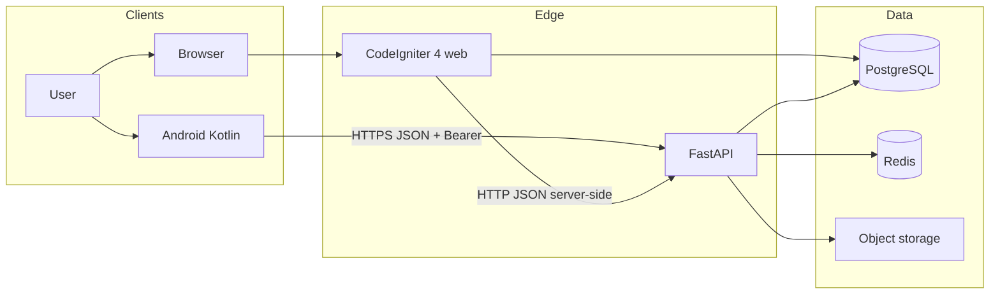
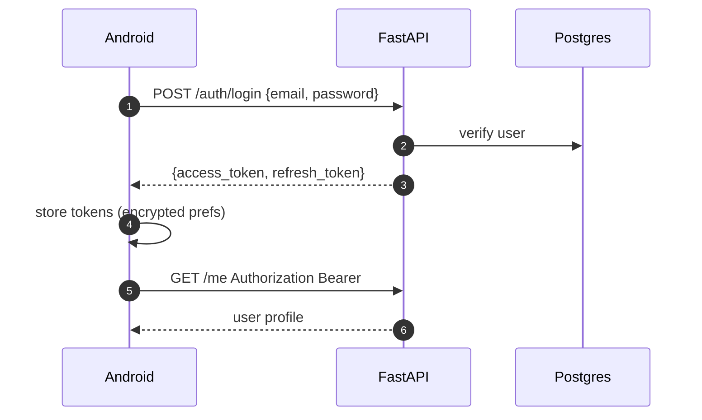
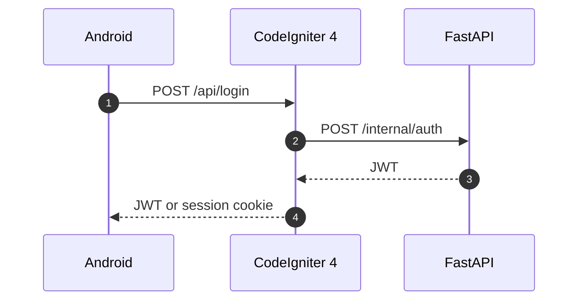
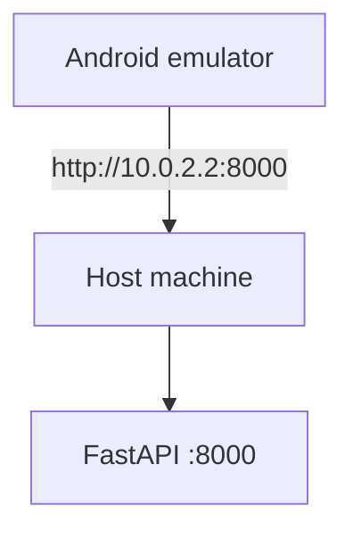
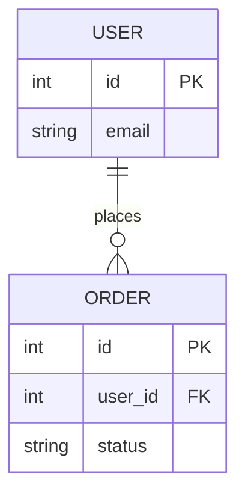
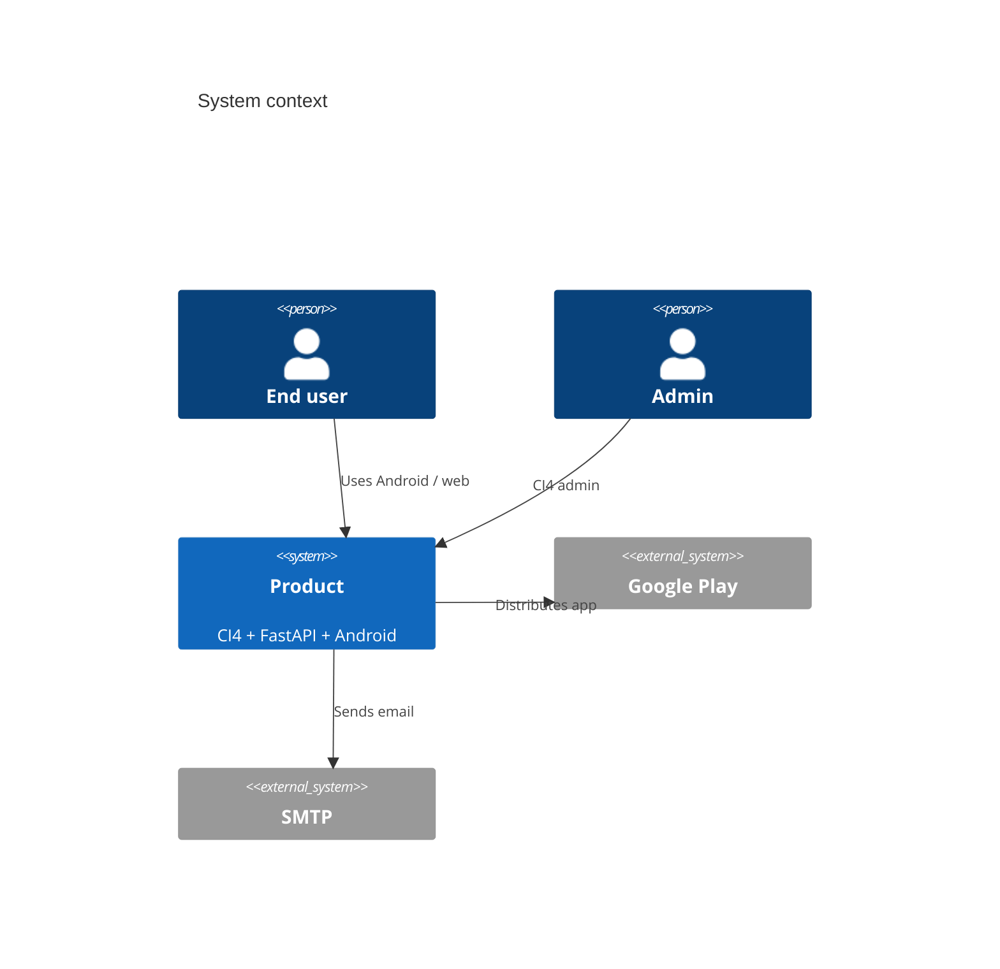

# Diagrams (required)

Use **Mermaid** in Markdown (GitHub/GitLab render it). No "paste this into mermaid.live" notes.

Every system gets at least:

1. Context or container diagram (`docs/architecture/overview.md`)
2. One login/auth sequence (`docs/architecture/communication.md`)
3. One core-feature sequence
4. ERD **only** if schema was read from migrations/models (not invented)

Fill names, ports, and auth from the repo.

## Container diagram (adapt)

If CI4 is only a UI and FastAPI owns data, **do not** draw CI4 → Postgres. Draw the real ownership.

## Sequence: login (example pattern — replace with actual)

If login is CI4 session and Android uses a **BFF**:

## Sequence: emulator networking (document this if Android exists)

Physical device: same LAN IP, or `adb reverse tcp:8000 tcp:8000`.

## Communication table (always pair with diagrams)

| From | To | Transport | Auth | Base URL (dev) | Notes |
|------|----|-----------|------|----------------|-------|
| Android | FastAPI | HTTPS JSON | Bearer JWT | `http://10.0.2.2:8000` | flavors for staging/prod |
| Browser | CI4 | HTTPS + cookie | CI4 session | `http://localhost:8080` | CSRF filters |
| CI4 | FastAPI | HTTP JSON | service token / JWT | `http://fastapi:8000` | compose DNS name |

## ERD snippet (from real models only)

## C4-style context (simple)

If C4 Mermaid is unsupported in their host, use `flowchart` instead.

## Rules

- Label protocols (`HTTPS`, `JWT`, `cookie`)
- Label **dev ports** that compose actually publishes
- Do not show both "shared DB" and "API owns data" — pick the truth
- Keep diagrams readable: 5–12 nodes
