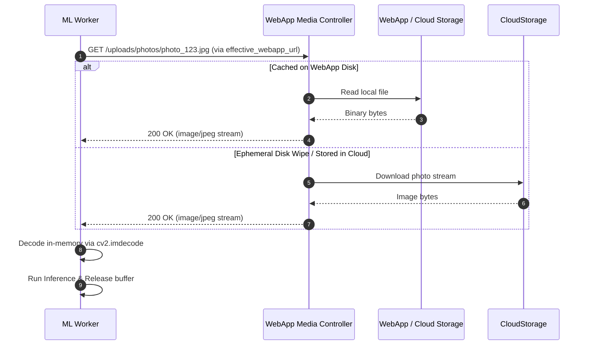
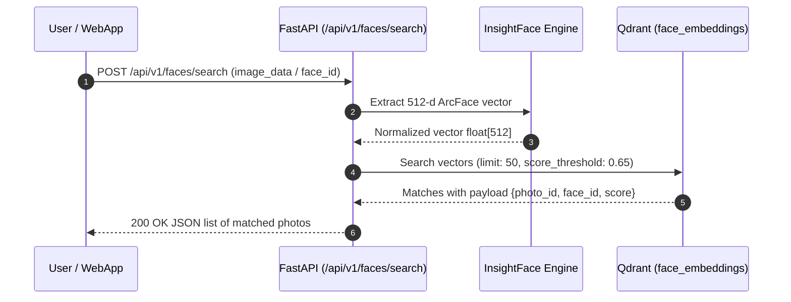

# Inter-Service Communication — ML Chege Photos

This document details the network protocols, API authentication, media rehydration mechanics, and inter-service sequence diagrams connecting the ML service with the Chege Photos ecosystem.

---

## Communication Matrix

| Source | Destination | Protocol | Port | Authentication | Purpose |
|---|---|---|---|---|---|
| **WebApp (PHP)** | **FastAPI ML** | HTTP / REST | 8000 | `X-API-KEY` header | Trigger scans, face searches, cluster jobs |
| **FastAPI ML** | **WebApp (PHP)** | HTTP / REST | 80 / 8080 | Session / Direct HTTP | Fetch image binaries on-demand for inference |
| **FastAPI ML** | **Qdrant DB** | HTTP / REST & gRPC | 6333 / 6334 | Optional API Key | Vector upsert, cosine search, collection management |
| **FastAPI ML** | **MySQL DB** | MySQL Protocol | 3306 | Username & Password | Store scan jobs, face metadata, identities |

---

## Authentication & Headers

Every request sent from the CodeIgniter 4 WebApp to ML Chege Photos endpoints (except `/health` and `/metrics`) must include:

```http
POST /api/v1/faces/search HTTP/1.1
Host: ml_app:8000
Content-Type: application/json
X-API-KEY: your_secure_shared_token
X-Webapp-Url: http://chege-photos-webapp:80
```

* **`X-API-KEY`**: Checked against `settings.ml_api_key`. Unauthorized requests immediately return `403 Forbidden`.
* **`X-Webapp-Url`**: Informs the ML service of the WebApp base URL so workers can dynamically fetch photos even if network topologies shift (e.g. dynamic Railway ephemeral subdomains).

---

## Media Rehydration Pattern

On cloud platforms like Railway or Render, container disks are ephemeral. Rather than copying all uploaded images onto the ML container disk:



This ensures the ML container remains completely stateless and can scale horizontally without file sync dependencies.

---

## Face Search Sequence (Synchronous)

For instant face recognition (e.g. user selects a face crop or uploads a query picture to find all matches):



---

## Related Documentation

* [Architecture Overview](overview.md)
* [API Contract](../api/contract.md)
* [Data & Storage (Qdrant & MySQL)](data-and-storage.md)
* [FastAPI Service Details](../services/fastapi.md)
