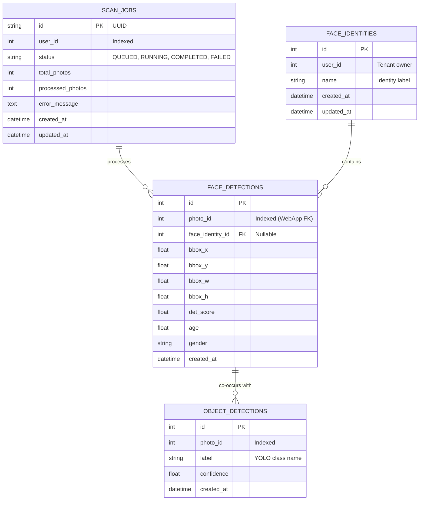

# Data & Storage Architecture — ML Chege Photos

This document defines the storage layers for ML Chege Photos: high-dimensional vector collections in Qdrant, relational metadata tables in MySQL, and the ephemeral image caching strategy.

---

## 1. Qdrant Vector Collections

ML Chege Photos manages three vector collections in Qdrant. All collections use **Cosine similarity** with vectors normalized to unit length.

| Collection Name | Dimension | Distance Metric | Description |
|---|---|---|---|
| `face_embeddings` | **512** | Cosine | Individual face vectors extracted via InsightFace ArcFace (`buffalo_l`). |
| `centroids` | **512** | Cosine | Representative centroid vectors for identified face clusters. |
| `photo_embeddings` | **512** | Cosine | Whole-photo semantic vectors extracted via CLIP (`clip-vit-base-patch32`). |

### Collection Schemas & Payloads

#### A. `face_embeddings`
* **Vector Configuration**:
  ```json
  {
    "size": 512,
    "distance": "Cosine",
    "hnsw_config": {
      "m": 16,
      "ef_construct": 100
    }
  }
  ```
* **Payload Fields**:
  ```json
  {
    "face_id": "int (Auto-increment PK from MySQL face_detections)",
    "photo_id": "int (Foreign Key to WebApp photos.id)",
    "user_id": "int (Multi-tenant partition key)",
    "cluster_id": "int | null (Assigned identity cluster)",
    "det_score": "float (Face detector confidence score)",
    "bbox": [120, 85, 310, 275]
  }
  ```

#### B. `centroids`
* **Payload Fields**:
  ```json
  {
    "cluster_id": "int (Unique cluster identifier)",
    "user_id": "int (Multi-tenant partition key)",
    "name": "string (Named identity label, e.g. 'John Doe')",
    "sample_count": "int (Number of face instances merged into this centroid)",
    "updated_at": "string (ISO-8601 timestamp)"
  }
  ```

#### C. `photo_embeddings`
* **Payload Fields**:
  ```json
  {
    "photo_id": "int (Foreign Key to WebApp photos.id)",
    "user_id": "int (Multi-tenant partition key)",
    "objects": ["dog", "beach", "sunset"]
  }
  ```

---

## 2. MySQL Relational Schema

Relational tables track jobs, detected bounding boxes, demographic metadata, and cluster mappings.



---

## 3. Ephemeral Image Caching & Memory Lifecycles

Because container environments like Railway wipe local disk storage on restarts:

1. **Zero Permanent Local Disk**: The ML service does not store raw photos permanently on its local filesystem.
2. **In-Memory Streaming**: Photos fetched via `effective_webapp_url` are decoded straight into NumPy arrays (`cv2.imdecode`) in memory.
3. **Explicit Memory Deallocation**: Image buffers and intermediate tensors are dereferenced immediately after embeddings are upserted into Qdrant to keep process RSS memory below the 2048 MB threshold.

---

## Related Documentation

* [Architecture Overview](overview.md)
* [Inter-Service Communication](communication.md)
* [ML Pipelines & Models](../services/ml.md)
* [Database Migrations](../engineering/making-changes.md)
