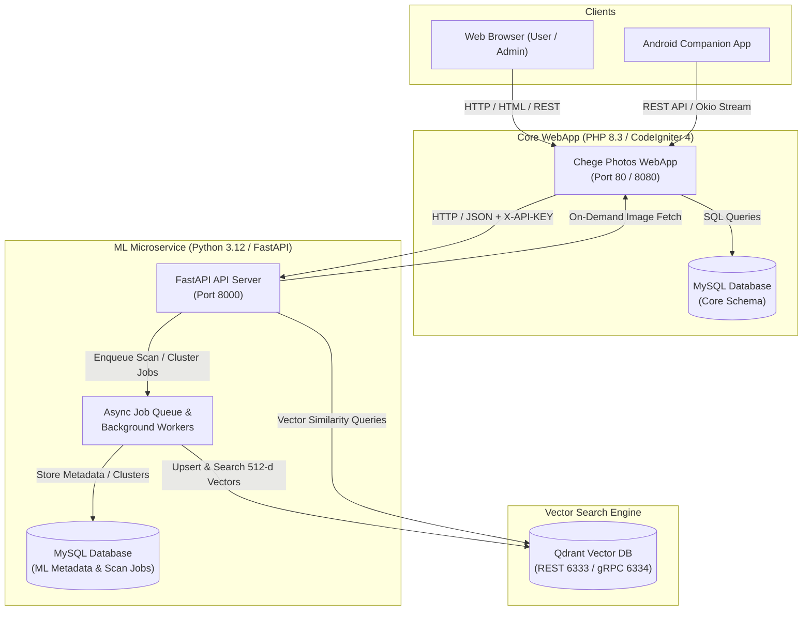
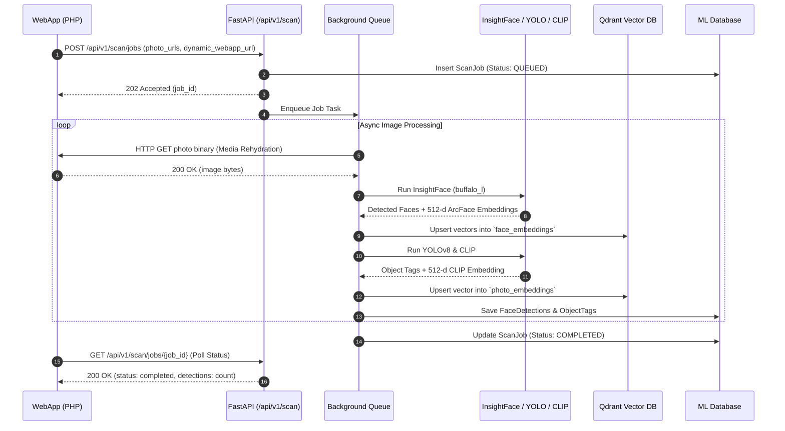

# Architecture Overview — ML Chege Photos

ML Chege Photos is a Python-based computer vision microservice designed to perform facial recognition, object detection, semantic image embeddings, and face clustering for the Chege Photos ecosystem.

---

## System Context & C4 Container Architecture

---

## Component Responsibilities

| Component | Technology | Responsibility |
|---|---|---|
| **FastAPI Gateway** | FastAPI, Uvicorn, Pydantic v2 | Ingests requests, validates tokens (`X-API-KEY`), routes face detection, search, and clustering tasks. |
| **InsightFace Pipeline** | InsightFace (`buffalo_l`), ONNX Runtime | Detects face bounding boxes, 5-point landmarks, age/gender, and extracts **512-dimensional ArcFace** embeddings. |
| **Object Detection** | Ultralytics YOLOv8 | Detects objects, scenes, and tags in uploaded photographs. |
| **Semantic Search** | OpenAI CLIP (`clip-vit-base-patch32`) | Generates **512-dimensional text and image embeddings** for natural language search queries. |
| **Clustering Engine** | HDBSCAN + Cosine Centroids | Performs identity clustering and incremental face assignment against existing centroid prototypes. |
| **Vector Database** | Qdrant | Stores and indexes high-dimensional vectors (`face_embeddings`, `centroids`, `photo_embeddings`) with HNSW cosine indexes. |
| **Metadata Database** | MySQL (SQLAlchemy + Alembic) | Tracks scan jobs, face detections, identities, and cluster assignments. |

---

## Machine Learning Pipeline Lifecycle

---

## Related Documentation

* [Inter-Service Communication](communication.md)
* [Data & Storage (Qdrant & MySQL)](data-and-storage.md)
* [Deployment Architecture](deployment.md)
* [ML Models & Pipelines](../services/ml.md)
