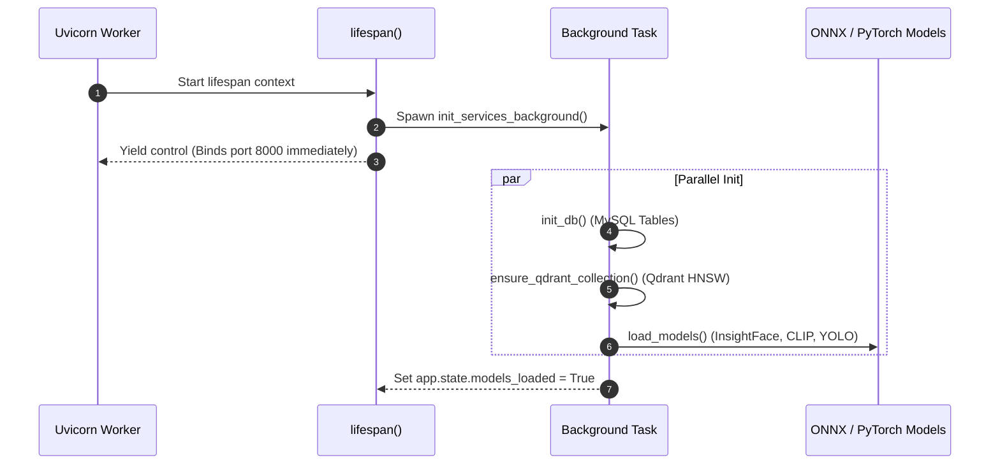

# FastAPI Service — ML Chege Photos

This document details the internal architecture of the FastAPI web application, covering the application factory, non-blocking lifespan initialization, authentication dependencies, and background queue management.

---

## 1. Application Lifecycle (`lifespan`)

FastAPI uses an asynchronous context manager (`@asynccontextmanager`) defined in [app/main.py](../../app/main.py) to manage startup and shutdown events.

### Non-Blocking Background Startup
To prevent slow neural network initialization or database timeouts from blocking Uvicorn from binding port `8000`:



This design guarantees that container health checks (`GET /health`) pass immediately, satisfying Railway and Kubernetes readiness probes without hitting startup timeout limits.

---

## 2. Authentication & Security Dependency

All operational endpoints enforce security using FastAPI's dependency injection system:

```python
from fastapi.security.api_key import APIKeyHeader
from app.config import settings

api_key_header = APIKeyHeader(name="X-API-KEY", auto_error=True)

async def get_api_key(api_key: str = Depends(api_key_header)):
    if api_key != settings.ml_api_key:
        raise HTTPException(
            status_code=status.HTTP_403_FORBIDDEN,
            detail="Forbidden: Invalid or missing X-API-KEY credential header"
        )
```

The dependency is applied globally to sub-routers in `app/main.py`:

```python
app.include_router(faces_router, dependencies=[Depends(get_api_key)])
app.include_router(scan_router, dependencies=[Depends(get_api_key)])
app.include_router(clusters_router, dependencies=[Depends(get_api_key)])
```

---

## 3. Background Job Queue & Maintenance

### A. In-Memory Job Queue (`ml_job_queue`)
Asynchronous photo scans are enqueued into `app.ml.queue.ml_job_queue`. Multiple worker coroutines process tasks concurrently up to `settings.ml_concurrent_workers`.

### B. Stale Scan Reaper (`stale_cleanup_loop`)
A background loop runs every 60 seconds to detect abandoned or crashed scan tasks exceeding `settings.scan_stale_timeout_sec` (default: 300 seconds) and reset their status to `FAILED` with an explanatory diagnostic message.

---

## 4. Directory Structure

```
app/
├── api/            # API Route definitions (faces, scan, clusters, etc.)
├── ml/             # Neural network loaders, inference, clustering
├── models/         # Pydantic schemas and SQLAlchemy ORM models
├── services/       # Business logic (scan workflows, face matching)
├── config.py       # Pydantic BaseSettings environment parsing
├── database.py     # SQLAlchemy session maker & Qdrant client
└── main.py         # App factory, lifespan, and router mounting
```

---

## Related Documentation

* [API Contract](../api/contract.md)
* [ML Pipelines & Models](ml.md)
* [Local Development Guide](../engineering/local-development.md)
