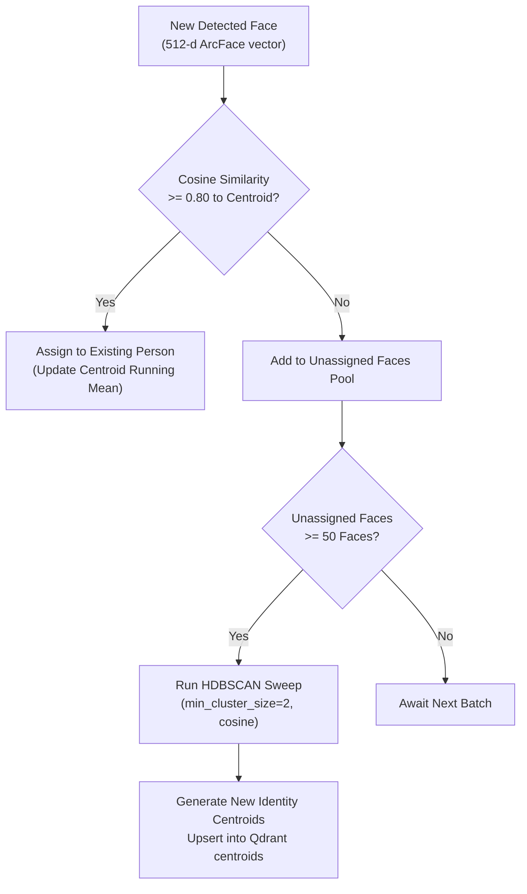

# Machine Learning Models & Pipelines — ML Chege Photos

This document describes the computer vision neural networks, inference engines, vector dimensions, and clustering algorithms implemented in ML Chege Photos.

---

## 1. Model Catalog

| Model | Framework / Checkpoint | Output Dimension | Purpose |
|---|---|---|---|
| **InsightFace** | `buffalo_l` (RetinaFace + ArcFace) | **512 float32** | Face detection, bounding boxes, landmarks, and identity recognition vectors. |
| **YOLOv8** | Ultralytics YOLOv8n / YOLOv8s | Detection BBoxes + Classes | Object, scene, and tag detection in photos. |
| **CLIP** | `openai/clip-vit-base-patch32` | **512 float32** | Multi-modal text and image embeddings for natural language search. |
| **GenderAge** | ONNX Runtime (`genderage.onnx`) | Age (int), Gender (M/F) | Demographic attribute estimation. |

---

## 2. Facial Recognition Pipeline (InsightFace ArcFace)

1. **Detection & Alignment**:
   * RetinaFace identifies face boundaries with a confidence threshold $\ge 0.50$.
   * 5 facial landmarks (eyes, nose tip, mouth corners) align the face into a standardized affine crop.
2. **ArcFace Embedding**:
   * Generates a **512-dimensional unit-normalized embedding** ($\|v\|_2 = 1.0$).
   * Invariant to minor lighting, pose, and expression variations.
3. **Indexing**:
   * Vectors are inserted into Qdrant's `face_embeddings` collection using an HNSW cosine index.

---

## 3. Face Clustering & Centroid Management

Groupings of similar faces are discovered using a two-tier clustering architecture:

### Centroid Calculation
When a cluster receives a new face or runs an HDBSCAN pass, its centroid $C$ is computed as the normalized mean vector of all member face embeddings $v_i$:

$$C = \frac{\sum_{i=1}^{N} v_i}{\left\|\sum_{i=1}^{N} v_i\right\|_2}$$

Using normalized centroids allows rapid $O(\log N)$ search in Qdrant rather than checking every individual face in the dataset.

---

## 4. Semantic Search (OpenAI CLIP)

* **Model**: `openai/clip-vit-base-patch32`
* **Image Encoder**: Converts input photos into a 512-dimensional vector.
* **Text Encoder**: Converts user search queries (e.g. `"birthday party with cake"`) into a 512-dimensional vector in the same shared embedding space.
* **Search Execution**: Queries Qdrant's `photo_embeddings` collection for photos with the highest cosine similarity to the encoded query text.

---

## 5. Object Detection (YOLOv8)

* Analyzes full-resolution images to extract tags (e.g. `dog`, `car`, `laptop`, `beach`, `mountain`).
* Labels with confidence $\ge 0.50$ are recorded in MySQL `object_detections` and attached as metadata to Qdrant photo payloads to facilitate combined visual and keyword filtering.

---

## Related Documentation

* [Architecture Overview](../architecture/overview.md)
* [Data & Storage Models](../architecture/data-and-storage.md)
* [API Contract](../api/contract.md)
* [FastAPI Implementation](fastapi.md)
